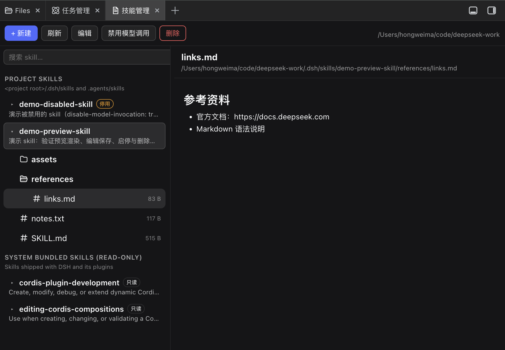

# @mhw12138/dsh-ui-better-sidebar-skill

<div align="center">
  <b style="font-size: 1.15em;">DSH Web GUI 的技能工作台：浏览、预览、编辑、管理你的全局与项目 skill</b><br /><br />
  <a href="https://github.com/Code-MR0/dsh-ui-better-sidebar-skill"></a>
  <a href="LICENSE"></a>
  
</div>

<div align="center">
  🌏 <a href="./README.zh.md"><b>中文</b></a>
</div>

<div align="center">
  
</div>

## ✨ 功能一览

- **🗂️ 资源浏览器**：按来源分级浏览全部 skill（项目 `.dsh/skills` / `.agents/skills`、全局 `~/.dsh/skills` / `~/.agents/skills`、系统内置只读），支持搜索；
- **🌳 懒加载目录树**：展开 skill 即露出其完整目录（`SKILL.md` 与所有文件），逐层按需加载、可折叠，视觉与 dsh-better-sidebar 的 Files 资源管理器一致；
- **📖 预览**：Markdown 渲染（标题/列表/代码块/引用/链接）、纯文本、二进制与大文件识别提示；
- **✏️ 编辑**：内联编辑器直接改写任意文本文件（含 `SKILL.md` frontmatter），原子保存；
- **➕ 管理**：新建（项目根或 `~/.dsh/skills`，生成标准 SKILL.md）、删除（移入可恢复的 `.trash`）、启用/禁用模型调用（改写 `disable-model-invocation`）；
- **↔️ 可调布局**：左栏（技能 + 文件树）与内容区按百分比拖拽调整，松手记忆。

## 🖼️ 功能预览

| 截图 | 说明 |
| --- | --- |
|  | 技能工作台总览：左侧资源浏览器，右侧 `SKILL.md` 预览 |
|  | 展开 skill 后的懒加载文件树（子目录逐层展开） |
|  | 内联编辑并保存 |
|  | 新建 skill 表单（项目 / 全局） |

> 截图占位：请将实拍截图放入 `screenshots/` 目录（文件名见上表），详见 [screenshots/README.md](screenshots/README.md)。

## 🔌 服务化接入

- 「技能管理」Tab 通过外部插件 [dsh-better-sidebar](https://github.com/omdsh-dev/DSH-better-sidebar) 的 `ctx.betterSidebar.registerTab` 注册，无 DOM 注入；
- 数据来自官方 skill 根约定的文件系统扫描，host 半区以 `node:fs` 提供 `/api/dsh-skill-studio/*` 路由族。

## ⚙️ 安装

> **前提条件：[dsh-better-sidebar](https://github.com/omdsh-dev/DSH-better-sidebar)
> 需单独安装** — 本插件运行时依赖其 `ctx.betterSidebar` 服务，刻意不声明
> 包依赖（结构镜像）。未安装时插件可装、Host 路由正常，但 Tab 不会出现。

```sh
dsh plugin --profile web add dsh-better-sidebar@latest                 # 前提
dsh plugin --profile web add @mhw12138/dsh-ui-better-sidebar-skill@latest
```

从源码安装（`pnpm install && pnpm build` 后）：

```sh
dsh plugin --profile web add link:$(pwd)
```

重启 `dsh web`，打开右侧面板的 + 菜单选择「技能管理」。

## 🛣️ 路由

| 路由 | 方法 | 说明 |
| --- | --- | --- |
| `/api/dsh-skill-studio/list` | GET | 分级技能列表（`?cwd=` 覆盖） |
| `/api/dsh-skill-studio/read` | POST | 读取 SKILL.md（`{ path }`） |
| `/api/dsh-skill-studio/list-dir` | POST | 列出一个目录层（懒加载树，`{ dir }`） |
| `/api/dsh-skill-studio/read-file` | POST | 读取 skill 目录内任意文件（`{ path }`） |
| `/api/dsh-skill-studio/write` | POST | 保存文本内容（`{ path, content }`） |
| `/api/dsh-skill-studio/create` | POST | 创建 skill（`{ root, name, description, whenToUse?, content, cwd }`） |
| `/api/dsh-skill-studio/delete` | POST | 移入 `.trash`（`{ path }`） |
| `/api/dsh-skill-studio/set-enabled` | POST | 启停模型调用（`{ path, enabled }`） |
| `/api/dsh-skill-studio/health` | GET | 健康检查 |

## 🔒 安全模型

- 全部路由走 loopback 信任围栏（socket 地址 + Host 头 + 浏览器同源标记）；装了
  dsh-remote-web-ui 时有效已配对设备 cookie 为额外放行路径，本插件不硬依赖它。
- 写路由只信任 skill 根（项目/全局/系统）下的路径；系统内置只读由路由层强制。
- 内容上限：read/write 1MB、create 512KB；Markdown 以 React 元素渲染（无 HTML 注入）。

## 📌 已知限制

- frontmatter 解析为零依赖轻量实现；生僻 YAML 以官方 dsh-skill-filesystem 为准。
- 项目组跟随侧边栏显示的 workspace（`scope.cwd`），项目根为其最近 `.git` 祖先。
- 界面文案暂为中文，后续可叠加 i18n 命名空间。

## 🙏 致谢

本插件基于外部插件 [dsh-better-sidebar](https://github.com/omdsh-dev/DSH-better-sidebar)
（MIT，作者 omdsh-dev）的右侧面板框架开发：Tab 经其 `ctx.betterSidebar` 服务注册，
文件树沿用其 Files 资源管理器视觉风格。本插件以 [MIT 协议](LICENSE) 发布。
